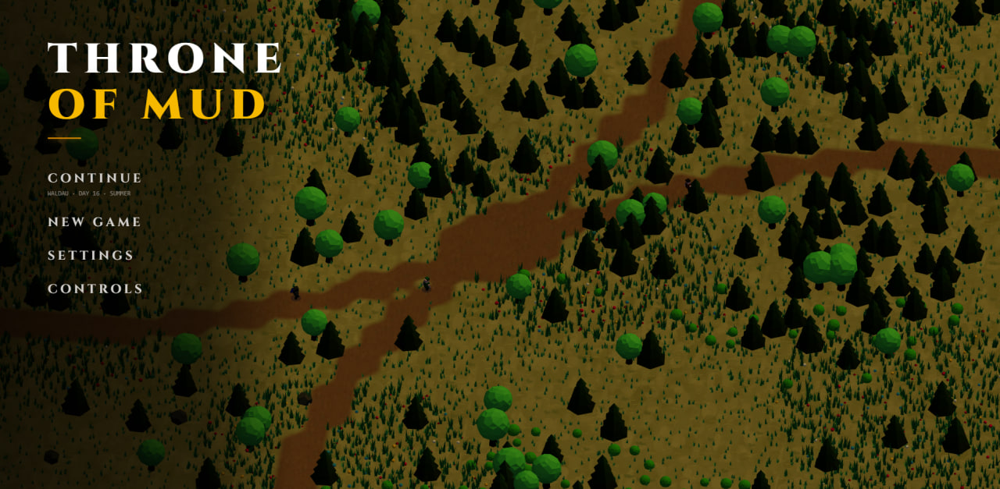

# Throne of Mud — 3D Colony Simulation

[](https://react.dev/)
[](https://www.typescriptlang.org/)
[](https://vitejs.dev/)
[](https://threejs.org/)
[](https://r3f.docs.pmnd.rs/)
[](https://github.com/hmans/miniplex)
[](https://zustand-demo.pmnd.rs/)
[](https://tailwindcss.com/)
[](https://developer.mozilla.org/en-US/docs/Web/API/Web_Audio_API)
[](https://developer.mozilla.org/en-US/docs/Web/API/IndexedDB_API)
[](https://www.khronos.org/opengl/wiki/OpenGL_Shading_Language)
[](https://oxc.rs/)

---

## Overview

**Throne of Mud** is an authentic medieval city-builder, feudal management, and colony simulation game rendered entirely in 3D WebGL via Three.js and React Three Fiber.

The game combines a high-performance **Entity Component System (ECS)**, deterministic procedural terrain generation, custom **GLSL weather and terrain shaders**, procedural medieval architecture, autonomous AI agents with emotional vitality systems, and real-time 3D spatial audio.

<p align="center">
  
</p>

---

## Tech Stack

### 3D Graphics & Simulation Engine
- **Three.js (r186) & React Three Fiber (v9)**: High-performance WebGL scene graph rendering, camera orchestration, and instanced mesh batching.
- **Custom GLSL Shader Pipeline**:
  - Multi-texture terrain splatting (`grass`, `mud`, `stone`, `water`) driven by continuous data texture coordinates.
  - Dynamic weather surface darkening (`uWetness`) and procedural raindrop splash rings.
  - Autumn seasonal color shifts (`uAutumnAmount`) and progressive winter snow accumulation (`uSnowAmount`).
  - Two-layer animated wave deformation with specular sun crest sparkles for open water bodies.
  - GPU vertex-shader foliage wind waves and elastic hit shudder responses.
- **Miniplex v2 (Entity Component System)**: High-frequency game loop separating entity state from behavior across decoupled systems (`JobSystem`, `MovementSystem`, `NeedsSystem`, `EconomySystem`, `ImmigrationSystem`, `BotAISystem`).
- **A* Pathfinding (`AStar.ts`)**: Heuristic path planning supporting obstacle bypass, dynamic building door alignments, and regional boundary constraints.
- **Simplex Noise & Mulberry32 PRNG**: Seeded deterministic mathematical noise for biome elevation, forest clusters, and highway curves.

### State Management & Architecture
- **Zustand v5 (Slice Pattern)**: Modular, decoupled store architecture:
  - `timeSlice`: Calendar progression, season cycles, and multi-stage weather transitions.
  - `settlementSlice`: Resource inventories, building assignments, chronicles, and AI lords.
  - `uiSlice`: Canvas interactions, tool selection, camera focus targets, and animations.
  - `audioSlice`: Channel gains, muting, and dual-language localization settings.
- **Clean Architecture & Separation of Concerns**: Strict decoupling between Presentation (React UI), 3D Renderers (Three.js), Simulation Logic (ECS), State Management (Zustand), and Persistence (IndexedDB).
- **Domain Entity Helpers (`entityHelpers.ts`)**: Encapsulated state mutators eliminating duplicate logic for thoughts, speech bubbles, and worker assignments.

### UI, Audio & Storage
- **React 19 & Tailwind CSS v4**: Medieval Gothic aesthetic inspired by historical manuscripts and parchment art direction (Cinzel typography, filigree headers, embossed buttons).
- **Web Audio API Engine (`AudioManager.ts`)**: 
  - Dynamic 3D positional audio emitters with spatial falloff.
  - Multi-layered environmental ambience (birds, campfire, night crickets, seasonal winds).
  - Dynamic footsteps adapted to terrain (dirt vs. grass) and medieval voice lines.
- **Full Dual-Language Localization (`i18n`)**: Complete Ukrainian (`uk`) and English (`en`) translation covering all buildings, resources, event chronicles, tooltips, and dialogues.
- **IndexedDB Save Engine (`saveManager.ts`)**: Resilient local persistence storing complete game state, grid modifications, and entity inventories with transaction integrity.
- **Oxlint**: Rust-powered ultra-fast static analysis ensuring strict code hygiene and zero compiler errors.

---

## Core Features

- **Procedural Feudal Realm**: 256×256 procedural map divided into 4 sovereign fiefs (*Goldhof*, *Waldau*, *Eichenau*, *Zweiau*), dissected by sinuous royal highways and organic biomes.
- **Procedural 3D Architecture**: Fully algorithmic medieval building generation (peasant cottages, timber-frame manors, rotating windmills, stone walls, bakeries, breweries, market stalls, and active construction scaffolds).
- **Dynamic Calendar & Weather System**:
  - Full 24-hour day/night cycle with realistic sun/moon arcs, shadow angles, and twilight color temperatures.
  - Dynamic multi-stage weather engine (Clear -> Rain -> Thunderstorm with lightning -> Snow).
  - Progressive seasonal shifts: Spring renewal, Summer clarity, Autumn foliage golden tints, and heavy Winter snow cover.
- **Interactive Forestry & Physics**:
  - Instanced forest rendering supporting thousands of trees with vertex-shader wind sway.
  - Responsive tree chopping physics: directional trunk elastic shudder upon axe strikes, flying woodchips, and angular tree felling animations.
- **Autonomous Settlers & AI Feudalism**:
  - Villagers manage vitality: Hunger, Rest/Energy, Mood, and Ale satisfaction.
  - Psychological Thoughts system with timed modifiers (e.g. *Employed*, *Preached*, *Camp Founded*).
  - Noble Lord commands: Rally peasant levy militias, preach from the pulpit for morale, or study manuscripts to enhance intellect.
- **Autonomous AI Bot Lords**: Independent neighboring fiefs expand, erect settlements, chop timber, and govern their own lands.
- **Real-Time Dirt Road Tool**: Freeform road drawing and erasing that dynamically rasterizes into the terrain shader with realistic edge blending.
- **Strategic Parchment Map View**: Seamless transition into an ancient cartographic parchment view detailing regional ownership, lord heraldry, and demographic analytics.

---

## Architecture & Project Structure

For detailed system architecture, directory structures, entity-component patterns, and diagrams, see the [Architecture Documentation](docs/README.md).

---

## Running Locally

### Prerequisites
- **Node.js**: v20.x or v22+ (tested on Node v24.20)
- **npm**: v10+

### Installation & Development

```bash
# 1. Clone the repository
git clone https://github.com/your-username/throne-of-mud.git
cd throne-of-mud

# 2. Install dependencies
npm install

# 3. Start development server with Hot Module Replacement (HMR)
npm run dev
```

The game client will be available at [http://localhost:5173](http://localhost:5173).

### Building for Production

```bash
# Typecheck and compile production bundle
npm run build

# Preview production build locally
npm run preview
```

### Linting & Code Hygiene

```bash
# Run ultra-fast Oxlint check
npm run lint
```

---

## In-Game Controls & Hotkeys

| Key | Action | Description |
| :--- | :--- | :--- |
| **`W` `A` `S` `D` / Arrows** | Camera Pan | Pan across the settlement and landscape |
| **Mouse Wheel** | Zoom In / Out | Smooth altitude zoom (tactical to aerial view) |
| **Right Mouse Drag** | Orbit / Rotate | Rotate camera angle and pitch |
| **`Space`** | Pause / Resume | Toggle simulation loop |
| **`1` `2` `3`** | Game Speed | Switch between 1x, 2x, and 5x simulation speed |
| **`T`** | Town Center Focus | Instantly center camera on your Lord's manor/tent |
| **`R`** | Road Tool | Toggle dirt road drawing and erase mode |
| **`M`** | Strategic Map | Toggle between top-down parchment view and 3D mode |
| **`Escape`** | Settings / Close | Close active inspector panel or open settings modal |

---

## License

This project is open-source and available under the [MIT License](LICENSE).
