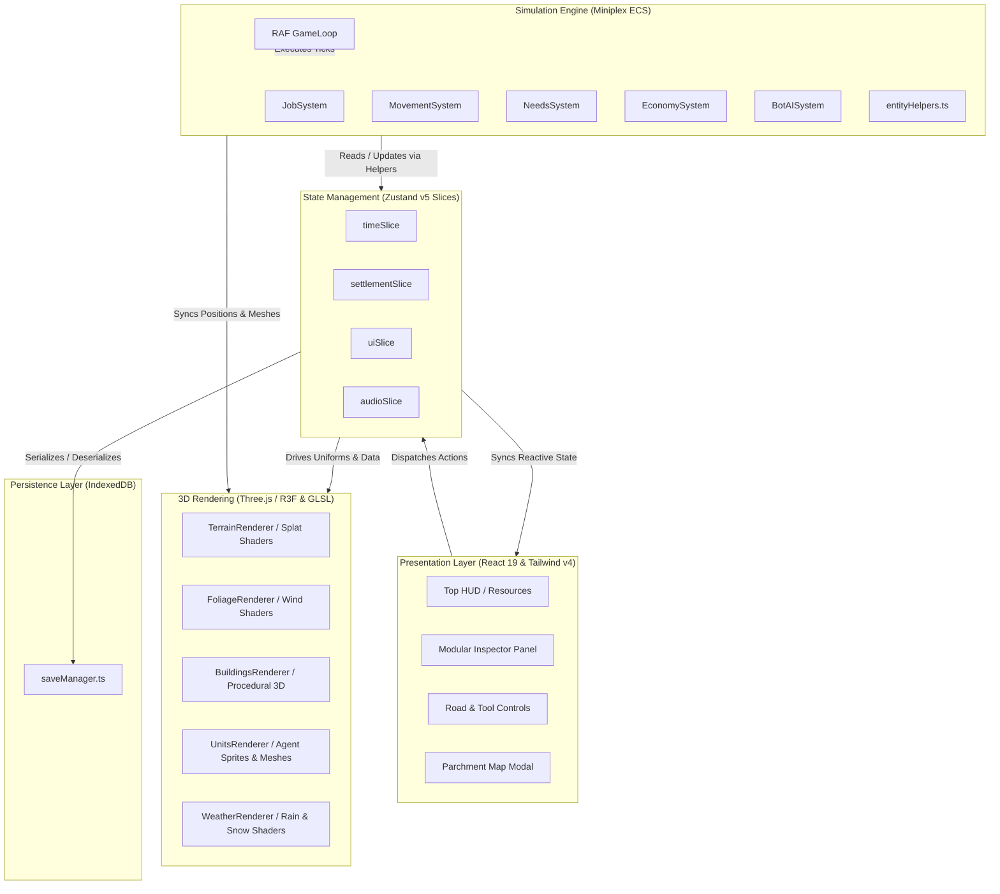

# System Architecture & Patterns

This document details the architectural layout, core design patterns, and module separation for **Throne of Mud**.

---

## Architecture

Throne of Mud follows a strictly decoupled, unidirectional data flow architecture separating:
- **Presentation Layer**: React 19 UI (Tailwind CSS v4) for HUD, inspector panels, dialogs, and strategic overlays.
- **3D Render Layer**: Three.js & React Three Fiber (R3F) handling WebGL meshes, procedural geometry, lighting, and custom GLSL shaders.
- **Simulation Layer**: Miniplex Entity Component System (ECS) driving real-time agent AI, jobs, movement, needs, and town production loops.
- **State Layer**: Zustand v5 modular slice store orchestrating global game time, active player actions, audio settings, and settlement-wide stats.
- **Storage Layer**: IndexedDB transaction manager storing serialized game worlds and entity states locally.



---

## Directory Layout

```
src/
├── components/
│   ├── audio/              # AudioController & spatial listener bridge
│   ├── canvas/             # Three.js / React Three Fiber 3D renderers
│   │   ├── buildings/      # Modular procedural 3D building builders
│   │   ├── BuildingsRenderer.tsx
│   │   ├── DayNightLighting.tsx
│   │   ├── FoliageRenderer.tsx
│   │   ├── GameCanvas.tsx
│   │   ├── TerrainRenderer.tsx
│   │   ├── UnitsRenderer.tsx
│   │   ├── WeatherRenderer.tsx
│   │   └── WoodChipsRenderer.tsx
│   ├── common/             # Error boundaries & generic layout guards
│   └── ui/                 # React HTML/Tailwind HUD components
│       ├── inspector/      # Modular entity, character, & building inspectors
│       ├── BottomActionBar.tsx
│       ├── InspectorPanel.tsx
│       ├── MainMenu.tsx
│       ├── MedievalIcons.tsx
│       ├── RoadToolPanel.tsx
│       ├── StrategicMapModal.tsx
│       ├── TopHUD.tsx
│       └── WeatherDebugModal.tsx
├── constants/              # Centralized domain constants (time, economy, world)
│   ├── economy.ts          # Resource costs, wage bounds, morale durations
│   ├── time.ts             # Ticks per minute, season offsets, day cycles
│   └── world.ts            # Map dimensions, default seed, region manifests
├── engine/
│   ├── assets/             # Three.js texture cache & AssetLoader
│   ├── audio/              # Web Audio API engine & ambient soundscapes
│   ├── buildings/          # Building blueprints, costs, and work slots
│   ├── ecs/                # Miniplex Entity Component System
│   │   ├── entityHelpers.ts # Encapsulated entity mutators (thoughts, jobs)
│   │   ├── world.ts        # ECS world instance & entity archetypes
│   │   └── systems/        # Decoupled simulation systems
│   │       ├── BotAISystem.ts
│   │       ├── EconomySystem.ts
│   │       ├── ImmigrationSystem.ts
│   │       ├── JobSystem.ts
│   │       ├── MovementSystem.ts
│   │       ├── NeedsSystem.ts
│   │       └── ProductionSystem.ts
│   ├── grid/               # GridMap, tile data, and terrain coordinates
│   ├── pathfinding/        # A* pathfinding algorithm
│   ├── resources/          # Natural resource deposits & quarries
│   ├── time/               # Main requestAnimationFrame GameLoop
│   └── world/              # World entity initializer & camp spawning
├── hooks/                  # Custom React hooks (audio, viewport, controls)
├── i18n/                   # Internationalization engine (EN / UK dictionaries)
├── services/storage/       # IndexedDB save/load manager
├── store/                  # Zustand modular state store
│   ├── slices/             # Time, UI, Audio, and Settlement slices
│   └── useGameStore.ts     # Root store composition
└── types/                  # Strict TypeScript domain interfaces
```

---

## Core Design Patterns

### 1. Entity Component System (ECS)
The simulation logic avoids deep inheritance hierarchies by relying on **Miniplex v2**:
- **Entities**: Simple containers of keyed components (e.g. `position`, `velocity`, `villager`, `job`, `needs`, `inventory`).
- **Archetypes**: Reactive queries over entities with specific components (`world.with('villager', 'position', 'needs')`).
- **Systems**: Decoupled tick functions executing on deterministic time intervals.

### 2. Zustand Slice Pattern
Rather than maintaining a single monolithic state store, state is segregated into focused slices:
- `timeSlice`: Controls calendar time, speed multipliers, and seasonal progression.
- `settlementSlice`: Manages inventory stockpiles, construction lists, logs, and lord interactions.
- `uiSlice`: Manages selection states, road painting mode, inspector focus, and UI overlays.
- `audioSlice`: Controls dynamic volumes, sound channels, and active locale.

All slices are bound together in `src/store/useGameStore.ts` using Zustand's `StateCreator` pattern.

### 3. Encapsulated Entity Mutators (`entityHelpers.ts`)
To adhere to DRY principles and prevent out-of-sync state, common mutations on ECS entities (assigning workers, adjusting thoughts, queueing speech bubbles) are isolated in pure helper functions rather than inlined across systems.

### 4. GPU Shader-Driven World Animation
High-performance dynamic effects are computed directly on the GPU via custom GLSL shaders:
- **Multi-texture splatting**: Continuous data textures blend grass, mud, rock, and water without expensive geometry rebuffering.
- **Weather integration**: Terrain darkness increases dynamically with `uWetness`, procedural rain rings ripple on surfaces, and snow accumulates via `uSnowAmount`.
- **Foliage sway**: Vertex shader wind waves animate thousands of instanced trees with zero CPU overhead.

---

[← Return to Main README](../README.md)
